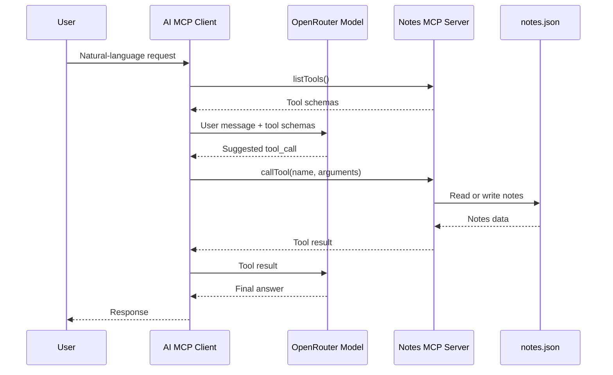

# AI MCP Client

The AI client connects two systems:

- OpenRouter for model reasoning and tool choice.
- Our MCP server for actual tool execution.

## Flow

## Key Idea

The model does not execute MCP tools directly.

The model chooses a tool call. The client executes that call against the MCP server.

Related notes:

- [[mcp-basics]]
- [[server-flow]]
- [[tools]]
