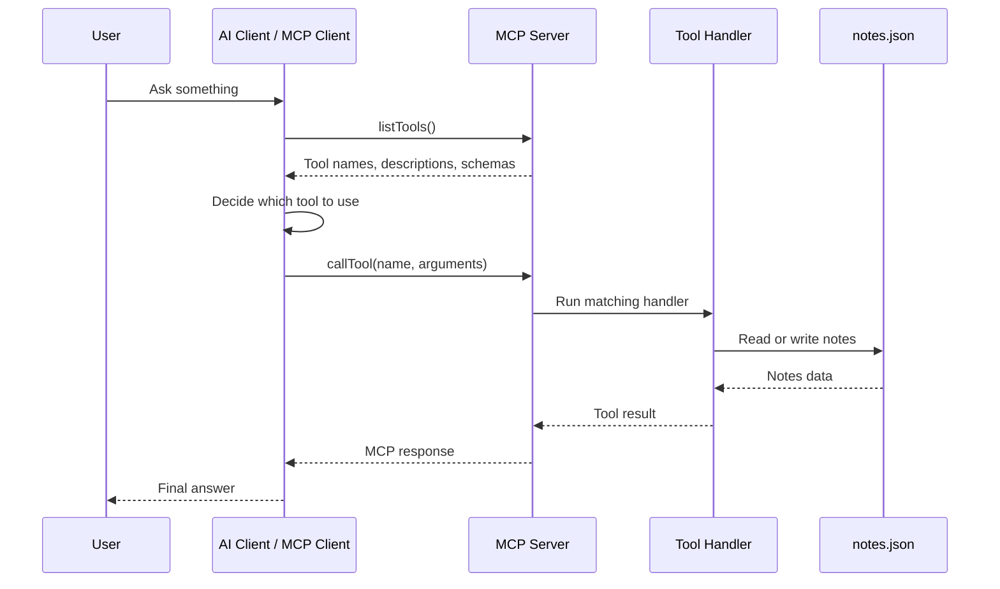

# Server Flow

This project uses stdio transport.

That means the MCP client starts the server process and talks to it through standard input and output.

## Flow

```text
MCP client
  starts server process
  asks server for available tools
  calls one tool with arguments

MCP server
  validates arguments
  runs TypeScript handler
  reads or writes data/notes.json
  returns result
```

## Diagram



## Current Files

- `src/index.ts`: creates the MCP server and connects stdio transport.
- `src/tools.ts`: registers the note tools.
- `src/notes.ts`: reads, writes, and formats notes.
- `src/smoke-test.ts`: test client that calls the server.

## Startup

`src/index.ts` creates the server:

```ts
const server = new McpServer({
  name: "notes-mcp-server",
  version: "1.0.0",
});
```

Then it registers tools:

```ts
registerNoteTools(server);
```

Then it connects to stdio:

```ts
await server.connect(new StdioServerTransport());
```

Related notes:

- [[mcp-basics]]
- [[tools]]
